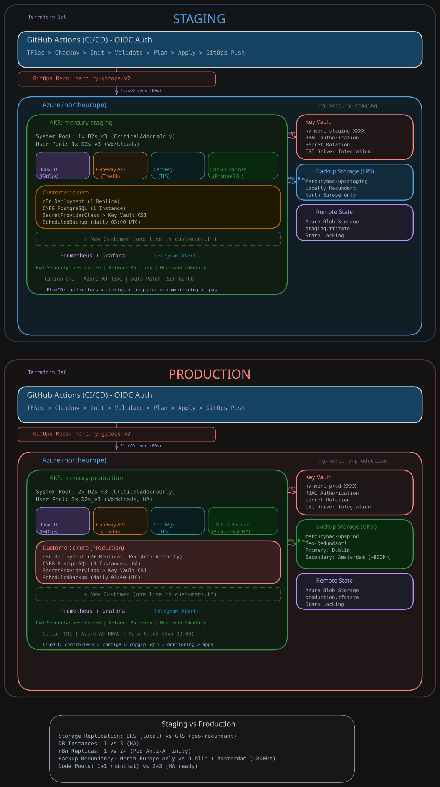

# Enterprise Multi-Tenant AKS Platform

Production-ready IaC platform for multi-tenant AKS on Azure. Automated customer provisioning, GitOps with FluxCD, and OIDC-based CI/CD via GitHub Actions.

## Architecture

<p align="center">
  <a href="docs/architecture.svg">
    
  </a>
</p>

## Customer Onboarding Flow

```
customers.tf                    Terraform Module              GitOps Repo                AKS Cluster
═══════════                     ════════════════              ═══════════                ═══════════

"cicero" ──► module "customers" ──► Generiert 11 YAMLs ──► FluxCD synct ──► Namespace
             │                      ├─ namespace.yaml                       ├─ n8n Pod
             │                      ├─ deployment.yaml                      ├─ PostgreSQL (HA)
             │                      ├─ service.yaml                         ├─ Secrets (Key Vault)
             │                      ├─ database.yaml                        ├─ Backups (Blob)
             │                      ├─ secrets.yaml                         └─ Monitoring
             │                      ├─ configmap.yaml
             │                      ├─ storage.yaml
             │                      ├─ scheduled-backup.yaml
             │                      ├─ ingress.yaml
             │                      ├─ kustomization.yaml
             │                      └─ grafana-secrets.yaml
             │
             ├─ Key Vault Secrets (DB Credentials, SAS Token)
             └─ Blob Container (Backups)
```
